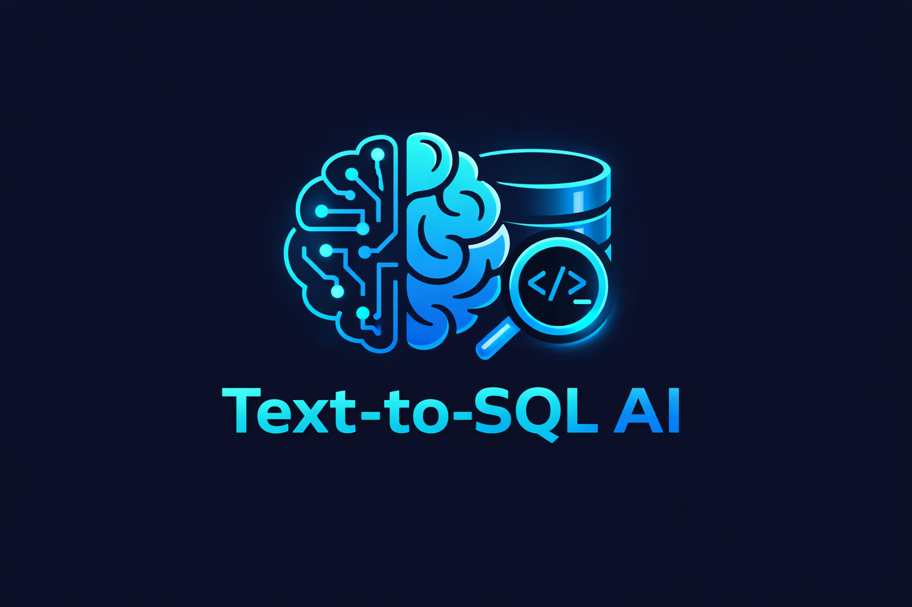
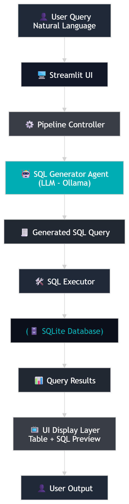

# 🤖 Text-to-SQL AI Assistant



---

## 🧠 Overview

This project is a **Text-to-SQL AI system** that allows users to interact with a database using natural language.

Instead of writing SQL manually, you can simply ask:

* “Who scored highest in Math?”
* “Show all students with grade A”
* “Average score in Science”

The system automatically:

1. Understands your question
2. Converts it into SQL using an LLM
3. Executes it on a database
4. Returns results in real-time

---

## 🏗️ System Architecture




---

## ⚡ Features

* Natural Language → SQL conversion
* Local LLM (no API cost)
* Chat-based UI
* SQL preview panel
* Real-time database execution
* Modular & scalable design

---

## 🧰 Tech Stack

* Python
* Streamlit
* LangChain
* Ollama
* Llama3 / Mistral
* SQLite

---

## 🚀 Getting Started

### 1️⃣ Clone Project

```bash
git clone https://github.com/jatin-shewale/Text-to-SQL-AI-Assistant.git
cd text-to-sql
```

---

### 2️⃣ Install Dependencies

```bash
pip install -r requirements.txt
```

---

### 3️⃣ Setup Database

```bash
python scripts/create_db.py
```

---

### 4️⃣ Run App

```bash
streamlit run app.py
```

---

## 💬 Example Queries

* Who scored highest in Math?
* Show all students with grade A
* What is the average score?

---

## 📊 Output

* 🧠 Generated SQL Query
* 📈 Result Table
* ⚡ Instant Response

---

## 🔥 Why This Project Matters

In real-world data workflows:

❌ Writing SQL repeatedly is slow
✅ Automating data access is powerful

This project demonstrates:

* LLM integration in real systems
* AI-powered automation
* Backend + UI architecture
* Industry-ready system design

---

## 👨‍💻 Author

**Jatin Shewale**

---

## ⭐ Support

If you like this project:

⭐ Star the repo
🚀 Share it
💡 Build on top of it

---
